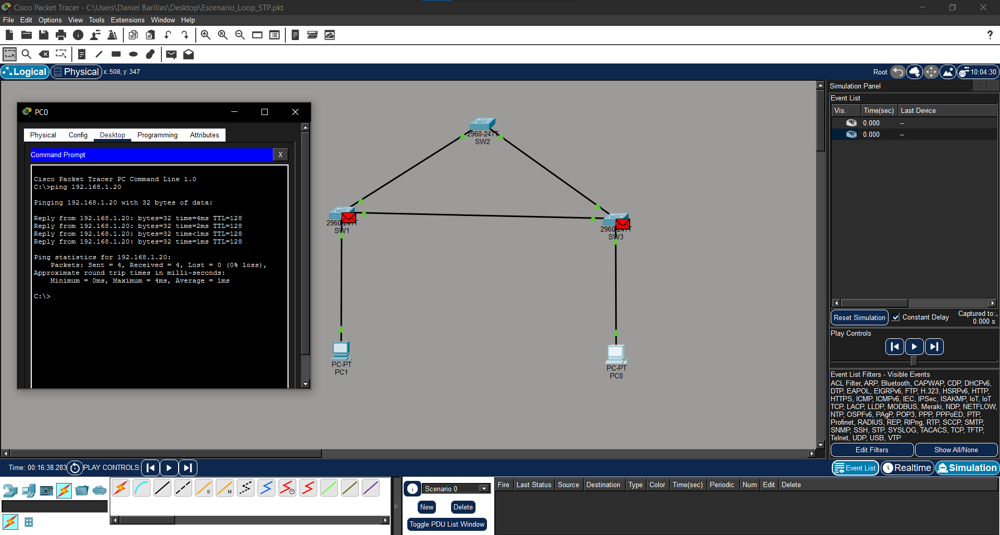
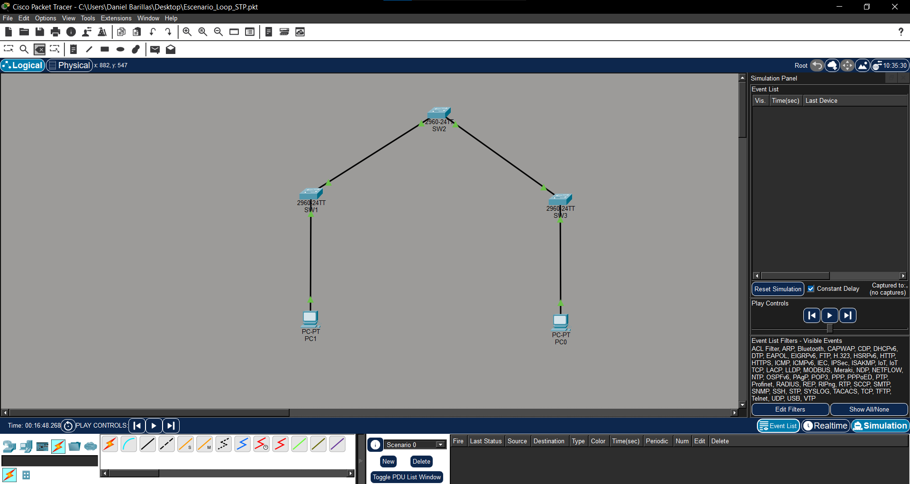

<div align="center">

# Loop L2 — Spanning Tree Protocol

### Simulación de un Loop de Capa 2 y mitigación mediante STP


---

**Universidad del Valle de Guatemala**<br>
**Curso:** CC3067 — Redes<br>
**Sección:** 10<br>
**Catedrático:** Kevin Antonio Velásquez Aguilar<br>
**Estudiante:** Pablo Daniel Barillas Moreno<br>
**Carné:** 22193<br>
**Año:** 2026

</div>

---

## Contenido

1. [Descripción](#descripción)
2. [Objetivos](#objetivos)
3. [Conceptos principales](#conceptos-principales)
4. [Topología implementada](#topología-implementada)
5. [Direccionamiento IP](#direccionamiento-ip)
6. [Procedimiento](#procedimiento)
7. [Comandos utilizados](#comandos-utilizados)
8. [Generación del loop](#generación-del-loop)
9. [Cómo se rompió el loop](#cómo-se-rompió-el-loop)
10. [Evidencias](#evidencias)
11. [Estructura del repositorio](#estructura-del-repositorio)
12. [Resultados](#resultados)
13. [Conclusiones](#conclusiones)

---

## Descripción

En esta actividad se construyó un escenario de red en **Cisco Packet Tracer** para demostrar cómo se origina un **Loop de Capa 2** cuando existen caminos redundantes entre switches y el protocolo **Spanning Tree Protocol (STP)** se encuentra desactivado.

La topología fue construida con tres switches Cisco 2960 conectados en forma de triángulo y dos computadoras ubicadas en los extremos de la red. Después de comprobar la comunicación inicial, STP fue desactivado en la VLAN 1 y se agregó el último enlace entre los switches para cerrar el circuito.

Posteriormente, se generó tráfico mediante el comando `ping` y se observó el comportamiento de las tramas en el modo de simulación. Finalmente, el loop fue interrumpido mediante la eliminación del enlace directo entre `SW1` y `SW3`. Además, se documentaron la reactivación de STP y el apagado administrativo de un puerto como métodos alternativos para prevenir o interrumpir el loop.

---

## Objetivos

### Objetivo general

Comprender cómo se produce un Loop de Capa 2 y comprobar el funcionamiento de STP como mecanismo de prevención en una red con enlaces redundantes.

### Objetivos específicos

* Construir una topología con caminos redundantes entre switches.
* Configurar dos computadoras dentro de la misma red local.
* Comprobar la comunicación utilizando mensajes ICMP.
* Desactivar temporalmente STP en la VLAN 1.
* Generar un Loop de Capa 2 de manera controlada.
* Observar la circulación de paquetes en el modo de simulación.
* Romper el loop mediante la desconexión de un enlace.
* Reactivar STP y comprobar el bloqueo de un puerto redundante.
* Documentar los pasos, comandos y resultados obtenidos.

---

## Conceptos principales

### Loop de Capa 2

Un **Loop de Capa 2** ocurre cuando existen varios caminos activos entre switches que forman un circuito cerrado. Las tramas Ethernet pueden circular repetidamente porque no poseen un mecanismo equivalente al TTL de los paquetes IP que limite cuántas veces pueden atravesar la red.

Este problema puede producir:

* Tormentas de broadcast.
* Duplicación de tramas.
* Inestabilidad en las tablas de direcciones MAC.
* Saturación del ancho de banda.
* Aumento en el uso de CPU y memoria de los switches.
* Pérdida de paquetes.
* Lentitud o interrupción completa de la red.

### Spanning Tree Protocol

**Spanning Tree Protocol (STP)** es un protocolo que evita los Loops de Capa 2 en redes con enlaces redundantes.

Los switches intercambian mensajes llamados **BPDU** para conocer la topología, seleccionar un switch principal llamado **Root Bridge** y calcular el mejor camino hacia él. Cuando STP identifica un enlace que podría cerrar un circuito, coloca uno de sus puertos en estado bloqueado.

El enlace permanece conectado físicamente, pero no transporta tráfico normal mientras exista otro camino activo. Si el enlace principal falla, STP puede habilitar el puerto bloqueado y utilizarlo como respaldo.

---

## Topología implementada

La práctica utiliza los siguientes dispositivos:

| Cantidad | Dispositivo               | Nombre                             |
| :------: | ------------------------- | ---------------------------------- |
|     3    | Switch Cisco 2960-24TT    | SW1, SW2 y SW3                     |
|     2    | Computadora Packet Tracer | PC0 y PC1                          |
|     5    | Enlaces Ethernet          | Conexiones de acceso y redundancia |

### Representación de la topología

```text
                         SW2
                        /   \
                       /     \
                    SW1-------SW3
                     |         |
                    PC1       PC0
```

### Conexiones utilizadas

| Dispositivo de origen | Puerto          | Dispositivo de destino | Puerto          |
| --------------------- | --------------- | ---------------------- | --------------- |
| PC1                   | FastEthernet0   | SW1                    | FastEthernet0/1 |
| SW1                   | FastEthernet0/2 | SW2                    | FastEthernet0/2 |
| SW2                   | FastEthernet0/3 | SW3                    | FastEthernet0/3 |
| PC0                   | FastEthernet0   | SW3                    | FastEthernet0/1 |
| SW1                   | FastEthernet0/4 | SW3                    | FastEthernet0/4 |

El enlace entre `SW1` y `SW3` fue utilizado para cerrar el circuito y producir el camino redundante.

---

## Direccionamiento IP

Las dos computadoras fueron configuradas dentro de la red `192.168.1.0/24`.

| Equipo | Dirección IP   | Máscara de subred | Puerta de enlace |
| ------ | -------------- | ----------------- | ---------------- |
| PC0    | `192.168.1.10` | `255.255.255.0`   | No requerida     |
| PC1    | `192.168.1.20` | `255.255.255.0`   | No requerida     |

No fue necesario configurar una puerta de enlace porque ambas computadoras pertenecen a la misma red local.

---

## Procedimiento

### 1. Creación del escenario

1. Se agregaron tres switches Cisco 2960.
2. Los switches fueron nombrados `SW1`, `SW2` y `SW3`.
3. Se agregaron las computadoras `PC0` y `PC1`.
4. Inicialmente, los switches fueron conectados como una cadena.
5. Se configuraron las direcciones IP de las computadoras.
6. Se verificó la comunicación mediante un `ping`.
7. Se desactivó STP para la VLAN 1 en los tres switches.
8. Se conectaron `SW1` y `SW3` para cerrar el triángulo.
9. Se generó tráfico ICMP en el modo de simulación.
10. Se observó la circulación de paquetes entre los switches.
11. Se eliminó uno de los enlaces para romper el loop.
12. Se comprobó nuevamente la comunicación después de retirar el enlace.
13. Se documentó la reactivación de STP como solución para conservar la redundancia sin permitir el loop.

---

## Comandos utilizados

### Prueba de conectividad

Desde la consola de `PC0` se ejecutó:

```cmd
ping 192.168.1.20
```

Resultado obtenido:

```text
Packets: Sent = 4, Received = 4, Lost = 0 (0% loss)
```

La prueba confirmó que inicialmente existía comunicación entre las computadoras.

### Desactivación de STP

Los siguientes comandos se ejecutaron en cada switch:

```text
enable
configure terminal
no spanning-tree vlan 1
end
show spanning-tree vlan 1
```

Al desactivar STP, el switch puede mostrar un mensaje similar a:

```text
No spanning tree instance exists.
```

> [!WARNING]
> La desactivación de STP se realizó únicamente dentro de una simulación controlada. No es una configuración recomendable para una red real con enlaces redundantes.

---

## Generación del loop

Después de desactivar STP en los tres switches, se agregó el siguiente enlace:

```text
SW1 FastEthernet0/4 ↔ SW3 FastEthernet0/4
```

Este enlace cerró el circuito formado por:

```text
SW1 → SW2 → SW3 → SW1
```

Luego se cambió Packet Tracer al modo **Simulation** y se generó tráfico desde `PC0` hacia `PC1`:

```cmd
ping 192.168.1.20
```

Se utilizó la opción **Auto Capture/Play** del panel de simulación para observar el recorrido y la repetición de las tramas.

En los filtros de simulación se seleccionaron principalmente:

* ARP
* ICMP

Con STP desactivado, los tres enlaces permanecieron activos y no existía ningún puerto bloqueado que interrumpiera el circuito de Capa 2.

---

## Cómo se rompió el loop

### Método 1: desconexión física

El loop fue interrumpido eliminando el enlace:

```text
SW1 FastEthernet0/4 ↔ SW3 FastEthernet0/4
```

Al eliminar este enlace, la topología dejó de formar un circuito cerrado.

### Método 2: apagado administrativo del puerto

También puede romperse mediante los siguientes comandos en `SW1`:

```text
enable
configure terminal
interface fastEthernet 0/4
shutdown
end
```

Para volver a activar el puerto:

```text
enable
configure terminal
interface fastEthernet 0/4
no shutdown
end
```

### Método 3: reactivación de STP

Como alternativa recomendada para conservar la redundancia, STP puede habilitarse nuevamente en los tres switches:

```text
enable
configure terminal
spanning-tree vlan 1
end
show spanning-tree vlan 1
```

Después de reconectar el enlace entre `SW1` y `SW3`, STP detecta el camino redundante y coloca uno de los puertos en estado bloqueado.

En la salida del comando puede aparecer un estado similar a:

```text
Altn BLK
```

Esto indica que el puerto es alternativo y se encuentra bloqueado para evitar el loop. Si el enlace principal falla, STP puede habilitarlo como camino de respaldo.

---

## Evidencias

### Escenario con Loop de Capa 2

La siguiente captura muestra:

* Los tres switches conectados en forma de triángulo.
* Todos los enlaces activos.
* Las dos computadoras de la red.
* El tráfico generado mediante `ping`.
* Los paquetes visibles en el modo de simulación.



### Escenario con el loop interrumpido

En esta captura se observa la topología después de eliminar el enlace directo entre `SW1` y `SW3`. La consola registra cuatro respuestas y 0 % de pérdida, confirmando que la comunicación se recuperó correctamente.



---

## Estructura del repositorio

```text
Loop-L2_Spanning-Tree-Protocol_Daniel-Barillas_22193/
├── Actividad-1/
│   └── Explicacion_Loop_STP.pdf
├── Actividad-2/
│   ├── Escenario_Loop_STP.pkt
│   ├── Video_Demostracion_Loop_Capa2.mp4
│   ├── Pasos_y_Comandos_Loop_STP.txt
│   ├── Screenshot_Loop_Capa2.png
│   └── Screenshot_Loop_Roto.png
├── LICENSE
└── README.md
```

### Descripción de archivos

| Archivo                         | Descripción                                                |
| ------------------------------- | ---------------------------------------------------------- |
| `README.md`                     | Documentación general de la práctica.                      |
| `Escenario_Loop_STP.pkt`        | Escenario original creado en Cisco Packet Tracer.          |
| `Explicacion_Loop_STP.pdf`      | Explicación escrita a mano sobre el Loop de Capa 2 y STP.  |
| `Pasos_y_Comandos_Loop_STP.txt` | Pasos y comandos utilizados para generar y romper el loop. |
| `Video_Demostracion_Loop_Capa2.mp4` | Demostración del loop, acumulación de tráfico, eliminación del enlace y recuperación de la comunicación. |
| `Screenshot_Loop_Capa2.png`     | Evidencia del escenario con el circuito cerrado.           |
| `Screenshot_Loop_Roto.png`      | Evidencia del escenario después de romper el loop.         |

---

## Resultados

Durante la práctica se consiguió:

* Construir correctamente una topología redundante.
* Establecer comunicación entre `PC0` y `PC1`.
* Desactivar STP temporalmente.
* Formar un circuito cerrado entre tres switches.
* Generar y visualizar tráfico en el modo de simulación.
* Interrumpir el loop eliminando un enlace.
* Comprobar que la comunicación se recuperó después de eliminar el enlace redundante.
* Documentar el funcionamiento de STP como mecanismo para prevenir Loops de Capa 2.

---

## Conclusiones

La práctica permitió comprobar que conectar switches mediante caminos redundantes puede causar un Loop de Capa 2 cuando no existe un protocolo encargado de controlar esos enlaces. En este escenario, la conexión triangular entre `SW1`, `SW2` y `SW3` creó un circuito cerrado al desactivar STP.

También se comprendió que eliminar uno de los enlaces rompe el loop, pero elimina parte de la redundancia de la red. Una solución más adecuada consiste en utilizar STP, ya que permite conservar físicamente los enlaces alternativos mientras bloquea de manera lógica el camino que podría producir el circuito.

Finalmente, la simulación demostró la importancia de STP para mantener redes estables, prevenir tormentas de broadcast y disponer de caminos alternativos ante la falla de un enlace principal.

---

<div align="center">

### Universidad del Valle de Guatemala

**CC3067 — Redes | Loop L2 y Spanning Tree Protocol**

Realizado por **Pablo Daniel Barillas Moreno — 22193**

</div>
